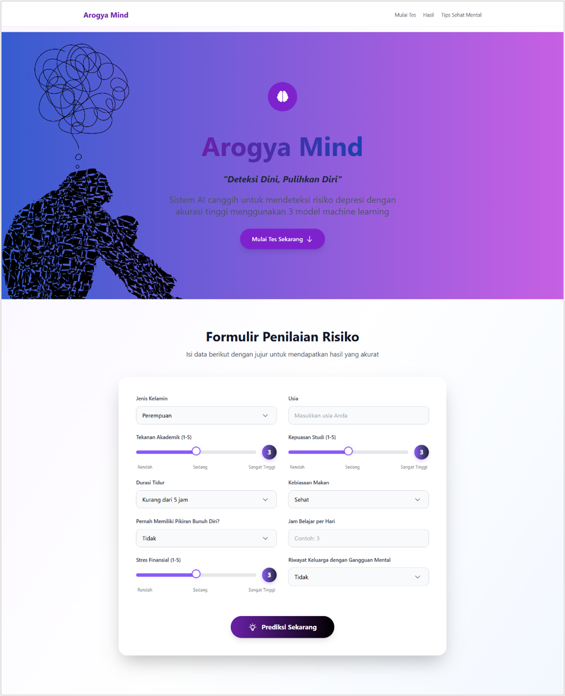
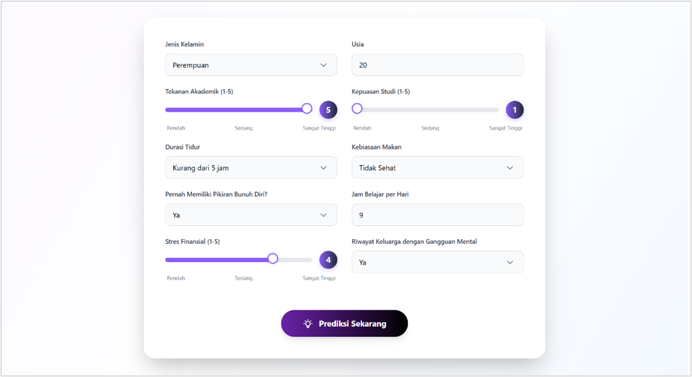
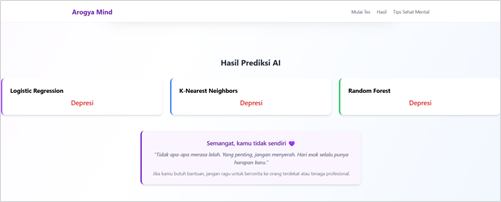
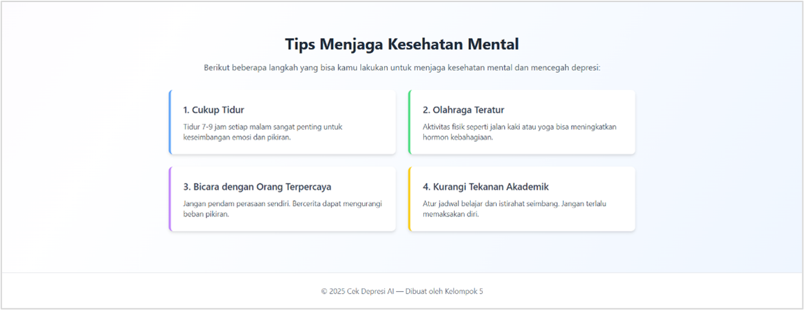

# Prediksi Depresi Mahasiswa Berbasis Machine Learning

## Deskripsi Proyek

Prediksi Depresi Mahasiswa merupakan aplikasi berbasis web yang dikembangkan untuk membantu mendeteksi risiko depresi pada mahasiswa menggunakan pendekatan Machine Learning. Sistem ini memanfaatkan data yang berkaitan dengan kondisi akademik, sosial, gaya hidup, dan kesehatan mental mahasiswa untuk menghasilkan prediksi secara otomatis.

Aplikasi ini dibangun menggunakan framework Flask dan mengimplementasikan model klasifikasi Machine Learning yang telah dilatih menggunakan dataset kesehatan mental mahasiswa. Sistem dirancang sebagai media edukasi dan demonstrasi penerapan Machine Learning dalam bidang kesehatan mental, khususnya untuk mendukung deteksi dini risiko depresi pada mahasiswa.

> **Catatan:** Hasil prediksi yang diberikan oleh sistem bukan merupakan diagnosis medis dan tidak dapat menggantikan konsultasi dengan tenaga kesehatan profesional.

---

## Tampilan Aplikasi

### Antarmuka Utama

<p align="center">
  
</p>

Halaman utama aplikasi yang menampilkan formulir input data mahasiswa untuk proses prediksi risiko depresi.

### Contoh Pengujian

<p align="center">
  
</p>

Contoh pengisian data mahasiswa yang digunakan sebagai input untuk proses prediksi.

### Hasil Prediksi

<p align="center">
  
</p>

Halaman hasil prediksi yang menampilkan status risiko depresi berdasarkan data yang dimasukkan pengguna.

### Halaman Tips Kesehatan Mental

<p align="center">
  
</p>

Halaman yang menyediakan informasi dan tips kesehatan mental sebagai bentuk edukasi bagi pengguna.

---

## Latar Belakang

Depresi merupakan salah satu gangguan kesehatan mental yang banyak dialami oleh mahasiswa akibat berbagai faktor seperti tekanan akademik, stres finansial, kurangnya kualitas tidur, serta kondisi sosial dan psikologis lainnya. Deteksi dini menjadi langkah penting untuk meningkatkan kesadaran dan membantu individu memperoleh penanganan yang tepat sejak awal.

Melalui pemanfaatan Machine Learning, proses identifikasi risiko depresi dapat dilakukan secara lebih cepat, konsisten, dan objektif berdasarkan pola yang ditemukan dalam data.

---

## Dataset

Dataset yang digunakan berasal dari platform Kaggle:

**Depression Student Dataset**

Dataset terdiri dari informasi mengenai:

- Gender
- Age
- Academic Pressure
- Study Satisfaction
- Sleep Duration
- Dietary Habits
- Suicidal Thoughts
- Study Hours
- Financial Stress
- Family History of Mental Illness

Target klasifikasi:

- Depresi (Yes)
- Tidak Depresi (No)

Jumlah data: **502 responden mahasiswa**

---

## Teknologi yang Digunakan

### Backend

- Flask 3.1.1
- Python 3.10+

### Data Processing & Machine Learning

- NumPy 2.2.5
- Pandas 2.2.3
- Scikit-Learn 1.6.1

### Frontend

- HTML
- CSS
- Bootstrap

---

## Struktur Proyek

```text
├── models/
│   └── model machine learning
├── static/
│   └── file CSS, JavaScript, gambar
├── templates/
│   └── halaman HTML
├── venv/
├── app.py
├── requirements.txt
└── README.md
```

---

## Tahapan Pengembangan

### 1. Pengumpulan Data

Menggunakan dataset kesehatan mental mahasiswa yang diperoleh dari Kaggle.

### 2. Preprocessing Data

Tahapan preprocessing meliputi:

- Label Encoding pada atribut kategorikal
- Normalisasi data
- Pembersihan data
- Transformasi fitur

### 3. Pelatihan Model

Model Machine Learning dilatih menggunakan data yang telah diproses untuk mempelajari pola yang berkaitan dengan kondisi depresi mahasiswa.

### 4. Evaluasi Model

Performa model dievaluasi menggunakan metrik klasifikasi seperti:

- Accuracy
- Precision
- Recall
- F1-Score
- Confusion Matrix

### 5. Deployment

Model yang telah dilatih diintegrasikan ke dalam aplikasi web berbasis Flask sehingga pengguna dapat melakukan prediksi secara langsung melalui browser.

---

## Fitur Sistem

- Input data mahasiswa melalui formulir web
- Prediksi risiko depresi secara real-time
- Tampilan hasil prediksi yang mudah dipahami
- Antarmuka sederhana dan responsif
- Implementasi model Machine Learning pada aplikasi web

---

## Instalasi

### 1. Clone Repository

```bash
git clone https://github.com/username/nama-repository.git
```

### 2. Masuk ke Folder Proyek

```bash
cd nama-repository
```

### 3. Buat Virtual Environment

```bash
python -m venv venv
```

### 4. Aktifkan Virtual Environment

Windows:

```bash
venv\Scripts\activate
```

Linux / MacOS:

```bash
source venv/bin/activate
```

### 5. Install Dependencies

```bash
pip install -r requirements.txt
```

### 6. Jalankan Aplikasi

```bash
python app.py
```

Aplikasi akan berjalan pada:

```text
http://127.0.0.1:5000
```

---

## Requirements

```text
Flask==3.1.1
numpy==2.2.5
pandas==2.2.3
scikit-learn==1.6.1
```

---

## Tujuan Pengembangan

Proyek ini dibuat sebagai implementasi penerapan Machine Learning untuk klasifikasi kesehatan mental mahasiswa sekaligus sebagai media pembelajaran mengenai:

- Data Preprocessing
- Machine Learning Classification
- Model Deployment
- Pengembangan Web dengan Flask
- Integrasi Machine Learning ke dalam aplikasi web

---

## Pengembang

1. Lutfi Laeli Nur Afiyah
2. Intan Komalasari
3. Moh. Arif Prasetyo
4. Nabe'ela Ayu Ning Tyas Zahra
5. Muh Kharis Maulana Elhaq


---

## Disclaimer

Aplikasi ini dikembangkan untuk keperluan pembelajaran, penelitian, dan demonstrasi penerapan Machine Learning. Hasil prediksi tidak dapat digunakan sebagai dasar diagnosis medis dan tidak menggantikan konsultasi dengan psikolog maupun tenaga kesehatan profesional.